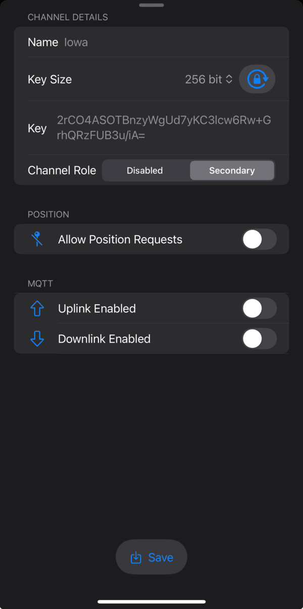

# Iowa Mesh Local Channel Configuration
Add the channel configuration below to communicate encrypted messages on Iowa Mesh.

1. Go to Settings and add/edit any channel other than channel 0

1. Channel Name `Iowa`

1. Channel Role `Secondary`

1. Enter the Pre-Shared Key
    - Iowa Mesh PSK: `2rCO4ASOTBnzyWgUd7yKC3lcw6Rw+GrhQRzFUB3u/iA=`

1. Allow Position Requests: `Enabled`

1. Precise Location `Enabled`

1. Disable MQTT Uplink and Downlink

!!! note "Location & MQTT Considerations"

    At some point, we may deploy a private MQTT server to be used for position data tracking. Both `Allow Position Requests` and `MQTT Uplink` will need to be enabled for this to work properly.

---

